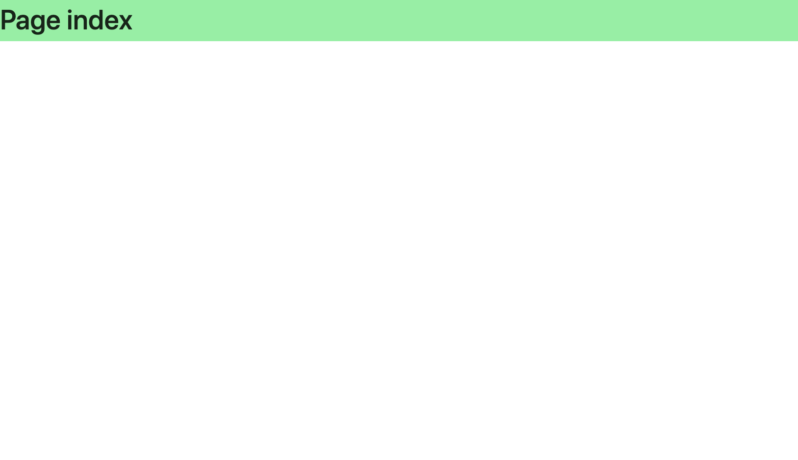
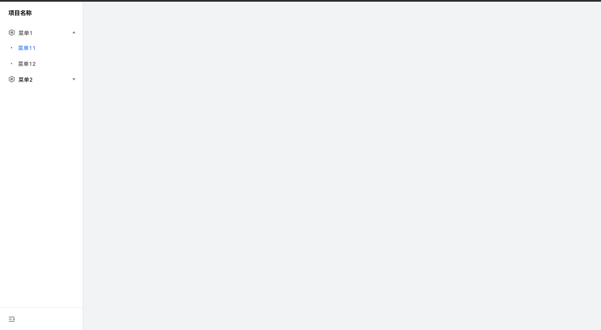
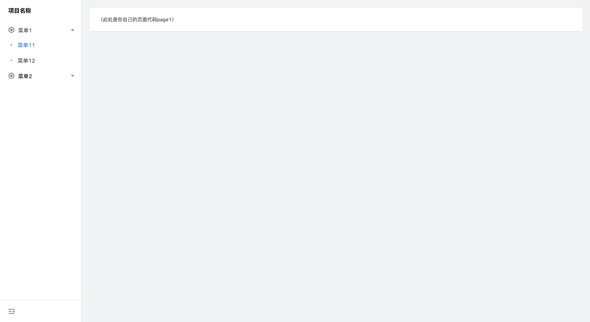

#  接入工作台项目搭建文档

## 一、环境

<!-- ### 1、官网接入 -->

1、电脑安装了node， 且版本是 10.13 或以上。

2、node -v   查看版本

## 二、项目搭建

1、建项目：

- 命令行建：mkdir myappname && cd myappname；

- umi脚手架工具创建项目：yarn create @umijs/umi-app；

- 安装依赖：yarn install；

2、启动项目：

- npm start 或者 yarn start；

- 浏览器打开 http://localhost:8000 看到如下页面即创建成功；



## 三、菜单&布局

### 1、tea组件使用

- 安装：
    - npm install tea-component；    

    - npm install oit-style；

- 使用：import { Button, Icon } from "tea-component";

- 样式：在src下新建app.js，并写入import 'oit-style';

参考链接：https://tea-design.github.io

### 2、菜单

- src目录下新建components文件夹(所有公共组件均放入这里，且每个公共组件都应有各自的文件夹)；

- components目录下新建leftMenu文件夹,并新建index.js文件，写入以下代码；

```js
import React from 'react';
import { withRouter, Link } from 'react-router-dom';
import { Menu,Icon } from 'tea-component';

const LeftMenu = () => {
  const MenuWithRouter = withRouter(function MenuWithRouter({ location }) {
    const pathname = location && location.pathname;
    return (
      <Menu
        theme="light" // 主题色
        title='项目名称'// 导航主文案
        collapsable // 是否可以收起
      >
        <Menu.SubMenu
          defaultOpened   // 是否默认展开菜单
          title={
            <div className="menu-item">
              <Icon
                type="menu-pimp-effective"
                className="svg-icon svg-icon-menu-pimp-effective menu-item-icon"
              ></Icon>
              <div className="menu-item-text">
                菜单1
              </div>
            </div>
          }
        >
          <Menu.Item
            title='菜单11'
            selected={pathname.startsWith('/dataDev/testData')}
            render={children => <Link to="/dataDev/testData">{children}</Link>}
          />
          <Menu.Item
            title='菜单12'
            selected={pathname.startsWith('/dataDev/createTable')}
            render={children => (
              <Link to="/dataDev/createTable">{children}</Link>
            )}
          />
        </Menu.SubMenu>
        <Menu.SubMenu
          title={
            <div className="menu-item">
              <Icon
                type="menu-pimp-effective"
                className="svg-icon svg-icon-menu-pimp-effective menu-item-icon"
              ></Icon>
              <div className="menu-item-text">
                菜单2
              </div>
            </div>
          }
        >
          <Menu.Item
            title='菜单21'
            selected={pathname.startsWith('/approvalCenter')}
            render={children => <Link to="/approvalCenter">{children}</Link>}
          />
        </Menu.SubMenu>
      </Menu>
    );
  });
  return (
    <>
      <MenuWithRouter />
    </>
  );
};

export default LeftMenu;
```
参考链接：https://tea-design.github.io/component/menu

### 3、布局

- src目录下新建layouts文件夹；

- layouts目录下新建index.js文件,并写入以下代码；

```js
import React from 'react';
import { Layout } from 'tea-component';
import LeftMenu from '@/components/leftMenu';    // 引入建好的菜单列表
const { Body, Header, Content, Sider } = Layout;

export default props => {
  return (
    <Layout className="customer_tea_layout">
      <Body>
        <Sider>
          <LeftMenu />   // 使用菜单
        </Sider>
        <Content>{props.children}</Content>
      </Body>
    </Layout>
  );
};
```
参考链接：https://tea-design.github.io/component/layout

### 4、关于路由

本项目采用约定式由，所以将 umirc.ts 中的 routes 配置注释掉，所谓约定式路由，就是没有 routes 配置的情况下，umi 会自动分析 src/pages 下面的目录，拿到路由配置。
```js
export default defineConfig({
  nodeModulesTransform: {
    type: 'none',
  },
  // routes: [
  //   { path: '/', component: '@/pages/index' },
  // ],
  fastRefresh: {},
});
```
每一个一级菜单都将对应pages下的一个一级目录，二级菜单对应二级目录或一级目录下的index.js文件。
然后就可以看到你的项目成了这样：


在pages下新建一个test文件夹，并新建index.js文件（约定式路由会自动查找每个目录下的index.js文件作为渲染页面，所以每个目录下都应有index.js文件）写入以下代码：
```js
import React from 'react'
import { Card, Layout } from "tea-component";
const { Content } = Layout;
export default () =>{
    return (
        <>
            <Content>
            {/* <Content.Header title='这是头部' />    工作台不需要 */}
                <Content.Body full>
                    <Card>
                    <Card.Body>
                    （此处是你自己的页面代码page1）
                    </Card.Body>
                    </Card>
                </Content.Body>
            </Content>
        </>
    )
}
```
然后将leftMenu中的菜单1下面的菜单11的selected以及render中link标签的to属性改为'/testPageone'，如下：
```html
<Menu.Item
    title='菜单11'
    selected={pathname.startsWith('/testPageone')}
    render={children => <Link to="/testPageone">{children}</Link>}
/>
```
同样的方法新建testPagetwo，然后将leftMenu中的菜单1下面的菜单12的selected以及render中link标签的to属性改为'/testPagetwo'，点击菜单11，12，此时你的项目就是这样的啦：

由于菜单11与菜单12同属菜单1，所以我们新建一个目录为menu1，将testPageone与testPagetwo移入，并在其所属菜单中的路径前加前缀'/menu1'，如：
```html
<Menu.Item
    title='菜单11'
    selected={pathname.startsWith('/menu1/testPageone')}
    render={children => <Link to="/menu1/testPageone">{children}</Link>}
/>
<Menu.Item
    title='菜单12'
    selected={pathname.startsWith('/menu1/testPagetwo')}
    render={children => <Link to="/menu1/testPagetwo">{children}</Link>}
/>
```
如果想要一进来项目就渲染某个页面，修改pagas下的index.jsx代码如下：
```js
import { Redirect } from 'react-router-dom';

export default () => {
  return <Redirect to="/menu1/testPagetwo" />;     // 此路径为页面首次打开所展示的页面，可根据要求自行修改路径
};
```

## 四、接入工作台（qiankun）
安装：yarn add @umijs/plugin-qiankun -D，然后在package.json里面加入 "name": "demo" (名字自取)

1、插件注册：umirc.ts中添加：
```js
export default defineConfig({
  qiankun: {
    slave: {},
  },
});
```

2、在 app.js 中配置运行时生命周期钩子：
```js
export const qiankun = {
  // 应用加载之前
  async bootstrap(props) {
    console.log('app1 bootstrap', props);
  },
  // 应用 render 之前触发
  async mount(props) {
    console.log('app1 mount', props);
  },
  // 应用卸载之后触发
  async unmount(props) {
    console.log('app1 unmount', props);
  },
};
```
3、环境变量配置：项目下新建.env文件，指定端口以及其他参数：
```js
SKIP_PREFLIGHT_CHECK=true
BROWSER=none
PORT=7103
WDS_SOCKET_PORT=7103
```
4、获取工作台传过来的数据：

- 在src下面新建一个store目录，新建global.js文件存放全局公共数据，这样在需要的地方引入store，就可以使用里面的数据了。

- 在应用加载之前，拿到工作台传过来的数据props，存入到store：
```js
import 'oit-style';
import store from './store/global';   // 引入全局store
export const qiankun = {
  // 应用加载之前
  async bootstrap(props) {
    console.log('app1 bootstrap', props);
    Object.assign(store, props);    // 将工作台传过来的数据存入store
  },
  // 应用 render 之前触发
  async mount(props) {
    console.log('app1 mount', props);
  },
  // 应用卸载之后触发
  async unmount(props) {
    console.log('app1 unmount', props);
  },
```
- 重新启动项目，然后在需要的地方引入store就可以使用里面的数据了：
```js
import store from '@/store/global';   // 引入全局store
```

参考链接：https://umijs.org/zh-CN/plugins/plugin-qiankun

## 五、接口请求
### 1、封装reauest请求
- 使用axios
 - 安装axios： npm install --save axios
 - 引入：import axios from 'axios';
 - 在src下面新建utils文件夹，并新建axiosrequest.js文件，写入以下代码（有能力也可自行封装）：
```js
import axios from 'axios';
import { notification } from 'tea-component';
// 集成环境
// const prefix = 'http://101.32.239.222:8080';
// 预发布环境
// const prefix = 'http://101.32.246.236:8080';
// 正式环境
// const prefix = 'http://101.32.161.20:8080';
// 本地
const prefix = '';
const codeMessage = {
  200: '服务器成功返回请求的数据。',
  201: '新建或修改数据成功。',
  202: '一个请求已经进入后台排队（异步任务）。',
  204: '删除数据成功。',
  400: '发出的请求有错误，服务器没有进行新建或修改数据的操作。',
  401: '用户没有权限（令牌、用户名、密码错误）。',
  403: '用户得到授权，但是访问是被禁止的。',
  404: '发出的请求针对的是不存在的记录，服务器没有进行操作。',
  406: '请求的格式不可得。',
  410: '请求的资源被永久删除，且不会再得到的。',
  422: '当创建一个对象时，发生一个验证错误。',
  500: '服务器发生错误，请检查服务器。',
  502: '网关错误。',
  503: '服务不可用，服务器暂时过载或维护。',
  504: '网关超时。',
};
//异常处理程序
const errorHandler = error => {
  const { response } = error;
  if (response && response.status) {
    const errorText = codeMessage[response.status] || response.statusText;
    const {
      status,
      config: { url },
    } = response;
    notification.error({
      message: `请求错误 ${status}: ${url}`,
      description: errorText,
    });
  } else if (!response) {
    notification.error({
      description: '您的网络发生异常，无法连接服务器',
      message: '网络异常',
    });
  }
  return response;
};
// axios.defaults.withCredentials = true;
axios.interceptors.response.use(
  response => {
    return response;
  },
  error => {
    errorHandler(error);
    return;
  },
);
//  * 配置request请求时的默认参数
// const umiRequest = extend({
//   errorHandler,
//   // 默认错误处理
//   credentials: 'include', // 默认请求是否带上cookie
// });
const customError = (ret, msg) => {
  if (ret === 40000) {
    // notification.error({
    //   description: '权限不足，请联系管理员',
    //   message: '权限不足',
    // });
    throw { ret: 40000, message: '权限不足，请联系管理员' };
    // return;
  }
  if (ret === 50000) {
    // notification.error({
    //   description: message !== undefined ? message : err,
    //   message: '系统错误',
    // });
    // return;
    throw { ret: 50000, message: msg !== undefined ? msg : err };
  }
  if (ret === 1) {
    notification.success({
      description: msg || 'SUCCESS!',
      message: msg || 'SUCCESS!',
    });
  }
  if (ret !== 0 && ret !== 1) {
    notification.error({
      description: msg || 'ERROR!',
      message: msg || 'ERROR!',
    });
  }

  // throw { ret, message };
};
const get = async (baseUrl, getdata = {}, options = {}) => {
  const response = await axios({
    method: 'get',
    url: `${prefix}${baseUrl}`,
    params: getdata,
    ...options,
  });
  // 这里逻辑有点怪
  if (response === undefined) {
    return false;
  }
  const { code, data, msg } = response.data;
  if (code !== 0) {
    customError(code, msg);
    return false;
  }
  return data;
};
const post = async (baseUrl, postdata = {}, options = {}) => {
  const response = await axios({
    method: 'post',
    url: `${prefix}${baseUrl}`,
    data: postdata,
    ...options,
  });
  // 这里逻辑有点怪
  if (response === undefined) {
    return false;
  }
  const { code, data, msg } = response.data;
  if (code !== 0) {
    customError(code, msg);
    return false;
  }
  return data;
};
const request = {};
request.get = get;
request.post = post;
export default request;
```

参考链接：https://www.kancloud.cn/yunye/axios/234845

### 2、配置接口列表

在pages下的某些目录中新建service.js文件，用来配置此目录需要发送的请求列表

- 引入封装好的axiosrequest:
```js
import request from '@/utils/axiosrequest';
```
- 书写请求列表（接口列表由后台提供）:
```js
// 获取审批列表
export function QueryApprovalFlow(postdata) {
  return request.post(`/sg/SysUserManage/QueryApprovalFlow`, postdata);
}
// 获取sql查询详情信息
export function QueryRecordDetails(params) {
  return request.get(`/sg/ToolQueryData/QueryRecordDetails`, params);
}
.
.
```

### 3、配置跨域请求代理
- 在 umirc.ts 中加入以下配置:
```js
proxy: {
    '/api': {
      target: 'http://localhost:8000/',       // 自行配置自己项目的地址，此处只是举例
      changeOrigin: true,
    },
  },
```

### 4、发送请求
- 在需要发送请求的页面引入service：
```js
import * as service from './service';      // 路径自行修改
```
- 在useEffect或需要调用接口的地方使用：
```js
const postdata = {后台需要的参数列表}
service.QueryApprovalFlow(postdata).then(res => {
      console.log(res)
});
```

## 六、打包部署
1、修改axiosreauest里面的prefix为要打包的环境的地址

2、去掉本地发送请求时写死的header参数（如果有）

3、运行 npm run build，将生成的dist包给到后台